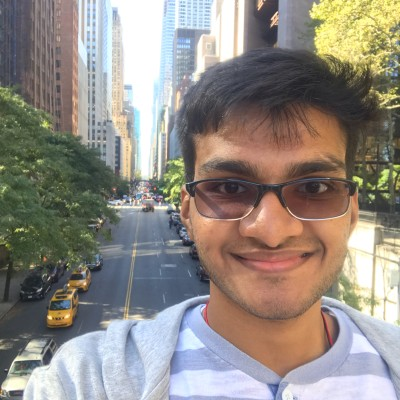

# Welcome to my Webpage!


Hi! My name is Keshab Agarwal and I am a second year Computer Science student at University of California San Diego.

### Some of my favorite topics in CS are:
1. *Data Structures and Algorithms*
2. **Cybersecurity**
3. Design Verification

### My hobbies are:
- Sketching
- Swimming
- Binge Watching TV Shows (Here is the link to my favorite show: [Friends](https://www.hbomax.com/series/urn:hbo:series:GXdbR_gOXWJuAuwEAACVH))

Here is my favorite quote by Gandhi:
> Be the change you wish to see in the world.

```
while(!successful){
  workHard();
}
```

You can take a look at the markdown file for this website [here](README.md).

